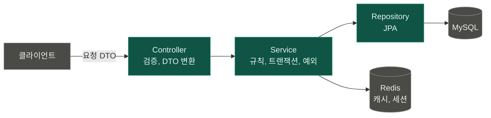

# 아키텍처

## 계층 구조

| 계층 | 하는 일 | 하지 않는 일 |
| --- | --- | --- |
| Controller | 요청 검증, DTO ↔ 서비스 호출 | 비즈니스 규칙, try-catch |
| Service | 규칙, 트랜잭션, 예외 던지기 | 엔티티를 밖으로 내보내기 |
| Repository | 조회·저장 | 예외 처리, 규칙 |

엔티티는 Controller 밖으로 나가지 않는다. 응답은 항상 DTO다.

## 클라이언트와 나누는 기준

판이 끝나면 사라지는 것은 클라이언트, 판 밖에서 남는 것은 서버가 맡는다.

| 서버 | 클라이언트 |
| --- | --- |
| 계정, 재화, 보상, 해금, 밸런스 테이블 | 판 안의 진행 상태, 쿨타임, 에셋 |

- 재화와 보상은 서버가 계산하고, 클라이언트는 서버가 준 잔액을 표시만 한다
- 같은 결과가 두 번 제출돼도 보상이 한 번만 들어가야 한다 (멱등성). 클라이언트는 실패하면 같은 요청을 재전송한다
- 결제 영수증과 광고 보상도 서버가 검증한 뒤 지급한다
